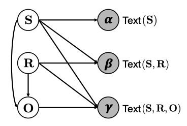

# Statistical Knowledge Assessment for Large Language Models
This project hosts the code for implementing the following paper accepted by NeurIPS 2023:

> [**Statistical Knowledge Assessment for Large Language Models**](https://arxiv.org/abs/1912.04488),            
> Qingxiu Dong, Jingjing Xu, Lingpeng Kong, Zhifang Sui, Lei Li   
> *arXiv preprint ([arxiv_version](https://arxiv.org/abs/2305.10519))*   


## Highlights
- **Probabilistic graphical model that decompose knowledge symbols and text forms:** Based on the probabilistic graphical model to tackle varying text alias regarding a fact, we propose KaRR, a statistical method to assess reliable knowledge contained in LLMs.
- **Large-scale assessment suite:** 994,123 entities and 600 relations, with their aliases/paraphrases.
- **Comprehensive evaluation of 14 recent LLMs:** Experiments show that KaRR  exhibits a strong correlation (0.43 Kendall's $\tau$) with human assessment, and achieves a lower variance to varying prompts.


---
## News
- This paper is accepted by NeurIPS 2023.
- We have released the code and data.


## Introduction
We introduce a statistical knowledge assessment method guided by latent variables and the KaRR metric, which quantifies a model's knowledge by computing its continuous probability across diverse text forms.  



## Pre-requisite
```bash
conda env create -f environment.yml
```
## How to calculate the KaRR score of a specific LLM/your own LLM quickly?
1. Download the data from [google drive](https://drive.google.com/drive/folders/1N86h0LL9GS8BVsnXwl42vQXGISVA2vB-?usp=sharing), and move it to `./data/` .
2. Generate the valid object aliases for your own model: Specify the model_name, check/modify the tokenizer in the following code and run it.
```bash
python $YOUR_PROJECT_PATH/code/data_preprocess/gen_obj_alias_clean_dict.py
```
3. Generate the probabilities:  Specify the model_name, check/modify the tokenizer and model loading method in `$YOUR_PROJECT_PATH/code/simple_rr_main_batch_update.py` and run as follows:
```bash
bash $YOUR_PROJECT_PATH/bash/simple_rr_main_batch_run.sh
```
4. Calculate the KaRR score. Modify the 
```bash
python $YOUR_PROJECT_PATH/code/data_readers/score_ranker.py
```

## Prepare Data for Knowledge Assessment
We have released the code for our data preprocessing below. If you only intend to use the preprocessed data for knowledge assessment, you can simply download the data from the Google Drive link provided above and skip this section.

### 1. knowledge source
We utilize T-REx knowledge graph as our primary source of symbolic knowledge. T-REx comprises 11 million triples that are aligned with 3.09 million Wikipedia abstracts; its quality is validated by extensive crowdsourcing evaluation.

Download T-REx from [the official website](https://hadyelsahar.github.io/t-rex/).

### 2. clean data from trex
```bash
python $YOUR_PROJECT_PATH/code/data_preprocess/trex_preprocess.py
python $YOUR_PROJECT_PATH/code/data_preprocess/preprocess_gendata.py
python $YOUR_PROJECT_PATH/code/data_preprocess/sample_examples.py
```
The code is based on https://github.com/wangcunxiang/Can-PLM-Serve-as-KB-for-CBQA.

### 3. get a subset examples for experiments
```bash
python $YOUR_PROJECT_PATH/code/data_preprocess/gen_data_for_main_exp.py
```
In our main experiments, we consider all 600 English relations available in T-REx and sample a maximum of 20 facts per relation, resulting in a total of 10,691 facts for knowledge assessment. You can also generate a larger set of facts for knowledge assessment by replace the sampling number.

### 4. get entity alias from Wikidata
```bash
bash $YOUR_PROJECT_PATH/code/data_preprocess/wikidata_get.sh
```
For the text forms of subjects and objects involved in calculating KaRR, we search the entity aliases from Wikidata with [Wikidata Integrator](https://github.com/SuLab/WikidataIntegrator). Ultimately, we obtain 1,349,474 aliases for 968,426 subjects and 368,511 aliases for 207,985 objects.

### 5. preprocess for OOV
We collect a vast range of aliases for objects, certain aliases may contain out-of-vocabulary (OOV) words. Consequently, the model generation probability for these aliases cannot be computed. To address this issue, we follow the approach suggested in LAMA and exclude OOV object aliases when implementing KaRR on each LLM.
Specify the model_name in the following code and run it.
```bash
python $YOUR_PROJECT_PATH/code/data_preprocess/gen_obj_alias_clean_dict.py
```
## Knowledge Assessment 

### KaRR
```
bash $YOUR_PROJECT_PATH/bash/simple_rr_main_batch_run.sh
```

### Baseline methods
LAMA and ParaRel are implemented through the following repo. Specially, they are designed for MLMs, we modified them for LLMs by deleting words following the objects in the templates. 

LAMA: https://github.com/facebookresearch/LAMA

ParaRel: https://github.com/yanaiela/pararel

K-Prompts baseline that computes the average probability of k randomly sampled prompts, utilizing a collection of ensembled high-quality prompts identical to those used in KaRR. We adopt K-Prompts as a simple baseline to evaluate the knowledge assessment in the absence of latent variables.

```bash
python $YOUR_PROJECT_PATH/code/simple_rr_main_batch_kprompts.py
```
All baseline methods are executed on the same set of facts as KaRR. 

### Models Path and KaRR Scoress
| Model | Path | Model Size | KaRR Score | 
| --- | --- |  --- | --- |
| GPT | https://huggingface.co/openai-gpt | 0.12B | 9.57|
| XLNet | https://huggingface.co/xlnet-base-cased | 0.12B | 5.86|
| T5-large | https://huggingface.co/t5-large | 0.74B | 3.22|
| GPT2-XL | https://huggingface.co/gpt2-xl | 1.56B | 12.27|
| GPT-NEO | https://huggingface.co/EleutherAI/gpt-neo-2.7B |2.65B | 13.44|
| T5-3B | https://huggingface.co/t5-3b | 3B | 9.52|
| LLM | https://huggingface.co/THUDM/glm-10b | 10B | 5.59|
| Dolly | https://huggingface.co/databricks/dolly-v2-12b | 12B | 15.60|
| LLaMA | https://github.com/facebookresearch/llama | 13B | 13.86|
| Alpaca | https://github.com/tatsu-lab/stanford_alpaca | 13B | 8.24|
| Vicuna | https://huggingface.co/lmsys/vicuna-13b-delta-v1.1 | 13B | 19.50|
| Moss | https://huggingface.co/fnlp/moss-moon-003-base | 16B | 11.20 |
| LLaMA-65B | https://github.com/facebookresearch/llama | 65B | 14.56 |
| OPT-175B |https://github.com/facebookresearch/metaseq | 175B | 23.06|

### Calculate KaRR scores from the output
```bash
python $YOUR_PROJECT_PATH/code/data_readers/score_ranker.py
```
## Citation
Please cite as:
```
@misc{dong2023statistical,
      title={Statistical Knowledge Assessment for Large Language Models}, 
      author={Qingxiu Dong and Jingjing Xu and Lingpeng Kong and Zhifang Sui and Lei Li},
      year={2023},
      journal = {Proceedings of NeurIPS},
}
```


